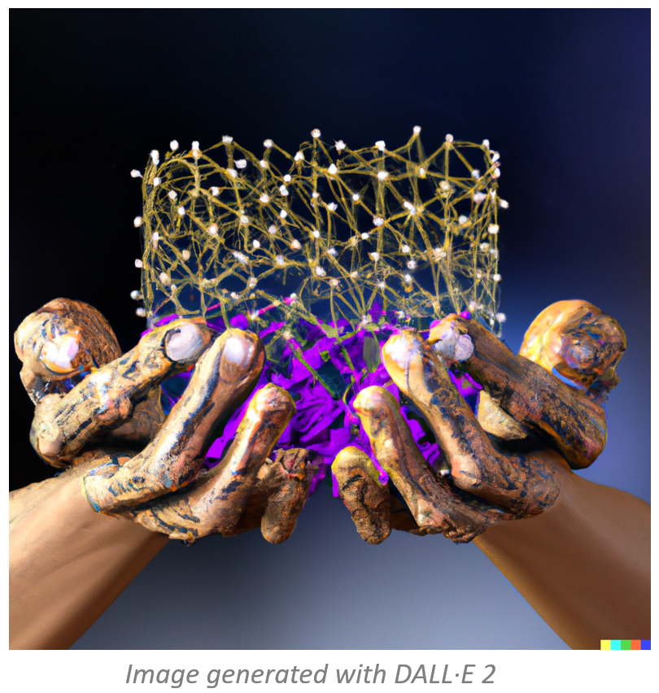

# Controlled Minibatch Algorithms

or

  

This repository provides the code used in the paper "Convergence under Lipschitz smoothness of ease-controlled Random Reshuffling gradient Algorithms". 

_Abstract_:
We consider minimizing the average of a very large number of smooth and possibly non-convex functions. 
This optimization problem has deserved much attention in the past years due to the many applications in different fields, 
the most challenging being training Machine Learning models. Widely used approaches for solving this problem are mini-batch 
gradient methods which, at each iteration, update the decision vector moving along the gradient of a mini-batch of the component functions. 
We consider the Incremental Gradient (IG) and the Random reshuffling (RR) methods which proceed in cycles, picking 
batches in a fixed order or by reshuffling the order after each epoch. Convergence properties of these schemes have
been proved under different assumptions, usually quite strong. We aim to define ease-controlled modifications of 
the IG/RR schemes, which require a light additional computational effort and can be proved to converge under very weak 
and standard assumptions. In particular, we define two algorithmic schemes, monotone or non-monotone, in which the IG/RR 
iteration is controlled by using a watchdog rule and a derivative-free line search that activates only sporadically to 
guarantee convergence. The two schemes also allow controlling the updating of the stepsize used in the main IG/RR 
iteration, avoiding the use of preset rules. We prove convergence under the lonely assumption of Lipschitz continuity
of the gradients of the component functions and perform extensive computational analysis using Deep Neural Architectures
and a benchmark of datasets. We compare our implementation with both full batch gradient methods and online standard 
implementation of IG/RR methods, proving that the computational effort is comparable with the corresponding online 
methods and that the control on the learning rate may allow faster decrease.

A free version of the paper can be found on [ArXiv](https://arxiv.org/abs/2212.01848).
 
To recreate the virtual environment used in the project, use the `environment.yml` file. 

The `dataset` folder could not be uploaded because of size issues on github. 
To download the data used in the project, please use the following [link](https://drive.google.com/drive/folders/1-jLyc8Wu66QcVGS9pMtJ0bvDsL_Xb6iJ?usp=share_link) to download them and place the files in the dataset folder

